# Presentation Storytelling Guide
## Screening Hit Rate Anomaly Detection — Swift Senior Applied Data Scientist

---

## The narrative arc in one sentence

> We proved the 15 series are independent, used that fact to justify a per-series
> robust detector, validated it analytically, then added a tree-based multivariate
> method that *thrives* on independence as a second opinion.

---

## Section A — Problem & Data (slides 1–4)

### Slide 1 — The silent risk
**Hook:** A spike in sanctions screening means more transactions get reviewed — annoying but safe.
A *drop* means the list is no longer catching what it should — silent, dangerous, potential regulatory breach.

Key message: **drops matter more than spikes**. This system is an early-warning detector for silent failures.

Business stakes: financial institution screens every transaction against sanctions lists (OFAC, UN, EU).
If a list gets truncated or corrupted, thousands of transactions sail through unscreened.

---

### Slide 2 — The data

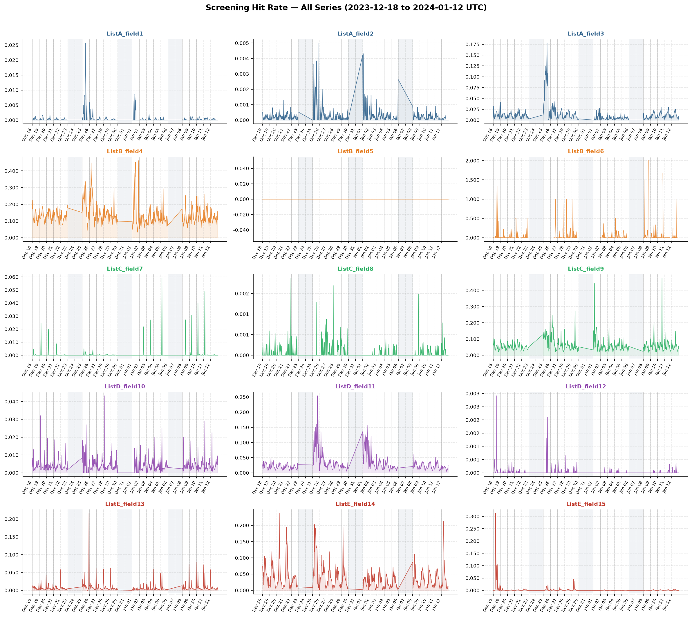

- 480 hours × 15 series (5 sanctions lists × 3 message fields each)
- 20 weekdays, 2023-12-18 to 2024-01-12 UTC — weekends excluded
- Hit rate = total hits / total screening requests. Can exceed 1 (one request can match multiple list entries)
- Zero = no requests that hour (not an anomaly). NaN = data collection failure (separate operational issue)

**Key data quality findings:**

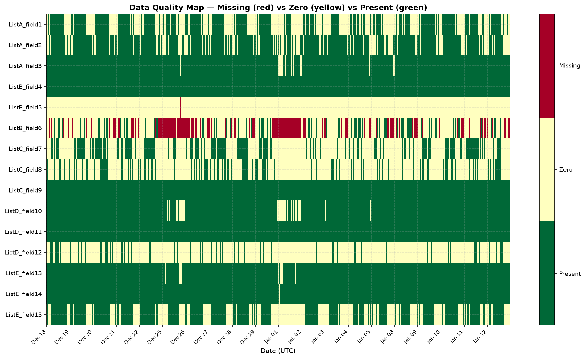

- ListB_field5: inactive, always zero — excluded from detection
- ListB_field6: 30% missing, unstable — treated with wider threshold, separate caveats
- ListA_field1: zero 46% of hours (sparse field type)
- ListC_field7: zero 64% of hours

---

### Slide 3 — The hidden denominator
We only see the ratio, not underlying request volume. This matters:
- Overnight hours: few requests → noisy ratio → less reliable baseline
- Business hours: high volume → tight, reliable baseline
- Same hit rate value of 0.05 means something very different at 50,000 requests vs 3 requests

**Mitigation:** use hour-of-day as a proxy for volume. Business hours get tighter anomaly bands.
This is the key design constraint that shapes everything that follows.

---

### Slide 4 — Diurnal pattern

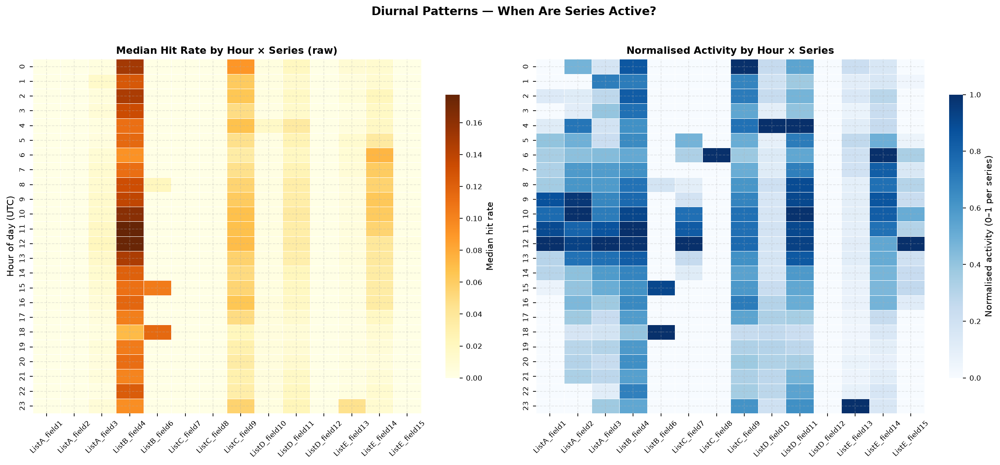

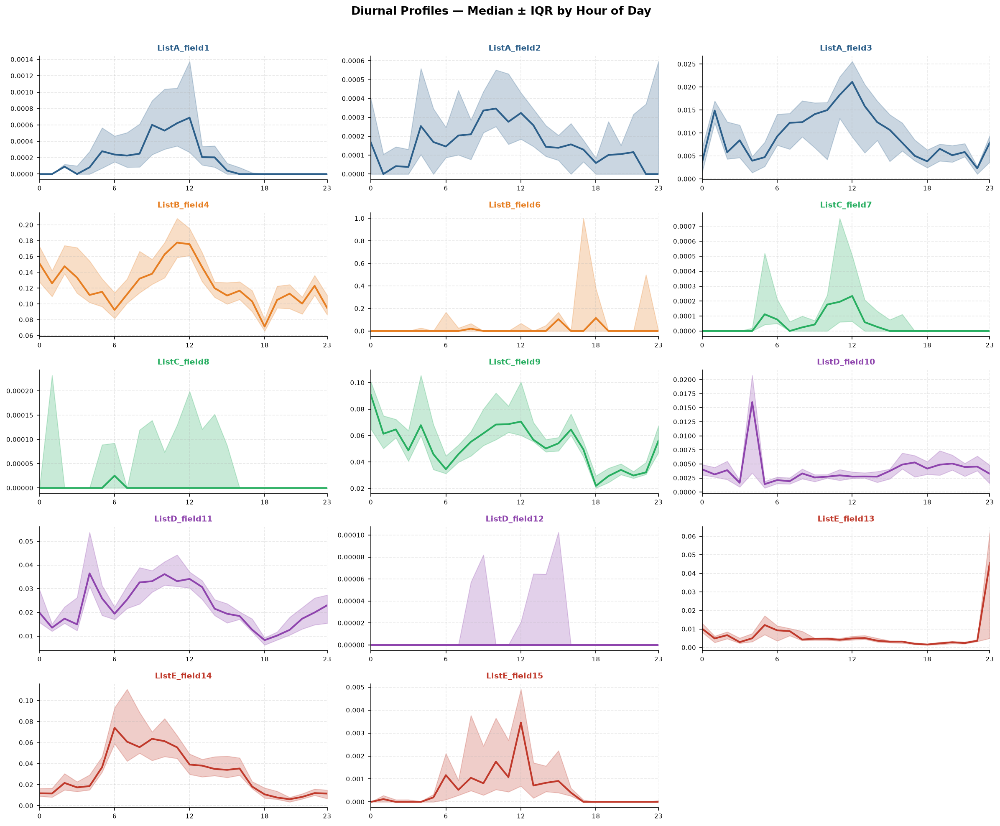

"Normal" is hour-specific. Hit rates at 03:00 UTC behave completely differently from 11:00 UTC.
Any detector that ignores this will drown in false alarms overnight.

This motivates the core design: **per-series, per-hour-of-day baseline**.

---

## Section B — Step 0: Are the series related? (slides 5–6)

*This section justifies the architecture before presenting the method.*

### Slide 5 — The question before the method
Before choosing a model, we asked: do the 15 series move together?
If yes → joint multivariate model. If no → treat independently.

Two independent views say **no**:

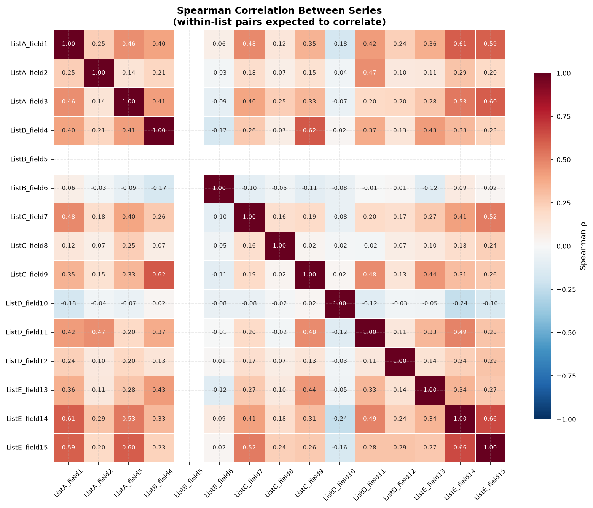

- Correlation heatmap: pairwise correlations near zero. Only ListA fields correlate (~0.41). Rest ≈ 0.

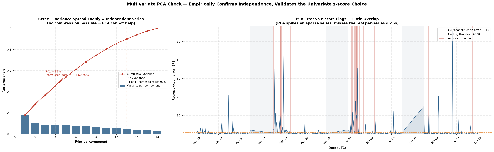

- PCA scree: PC1 explains only 18% of variance. Need 11 of 14 components to reach 90%.
  Genuinely correlated data concentrates 60–90% in PC1.

---

### Slide 6 — What this proves
The series are independent. A linear multivariate model (PCA) cannot compress them — it needs correlation and there is none.

**This is not a failure. It is a proof.**

PCA reconstruction detector agrees with z-score on only 1 of 44 flags — because there is no shared structure to exploit. The architecture is correct: **treat each series independently**.

Transition: *independence breaks PCA but is exactly what Isolation Forest needs — more on that in Section E.*

---

## Section C — Method 1: Robust Hourly Z-Score (slides 7–9)

### Slide 7 — The formula
For each series and each hour-of-day (0–23), fit a baseline from 20 weekday samples:

```
z = (observed − hourly_median) / (hourly_MAD × 1.4826)

Flag if z < −2.5
```

Why median and MAD, not mean and std:
- Hit rate distributions are skewed and zero-heavy
- Mean/std get dragged by outliers and holiday spikes
- Median/MAD are robust — the Dec 25 spike does not corrupt the baseline

Why hour-of-day specific:
- Baseline for ListA_field3 at 03:00 is completely different from 11:00
- One global mean would be meaningless and produce constant false alarms overnight

**Why hour-of-day and NOT hour × day-of-week** (defensive — you *will* be asked):
We tested it. Adding day-of-week reduces residual spread by only **11.5% on average**,
but splits each baseline cell 5 ways — from 20 observations down to ~4. That collapses
baseline reliability, and the 11.5% is partly overfit noise from the smaller sample.
**Verdict: hour-only is the right granularity for 20 weekdays of data.** Choice tested, not assumed.

---

### Slide 8 — Three flag types
| Symbol | Type | Meaning |
|--------|------|---------|
| ○ | drop_zscore | Statistically significant drop below hourly baseline |
| ○ | contextual_zero | Zero during normally active hour — potential list failure |
| × | contextual_zero_holiday | Zero on Dec 25 / Jan 1 — volume effect, not list failure |

Holiday zeros are de-prioritised: transaction volume drops on public holidays, so zero hits are expected.
The × symbol separates these from genuine operational alerts visually.

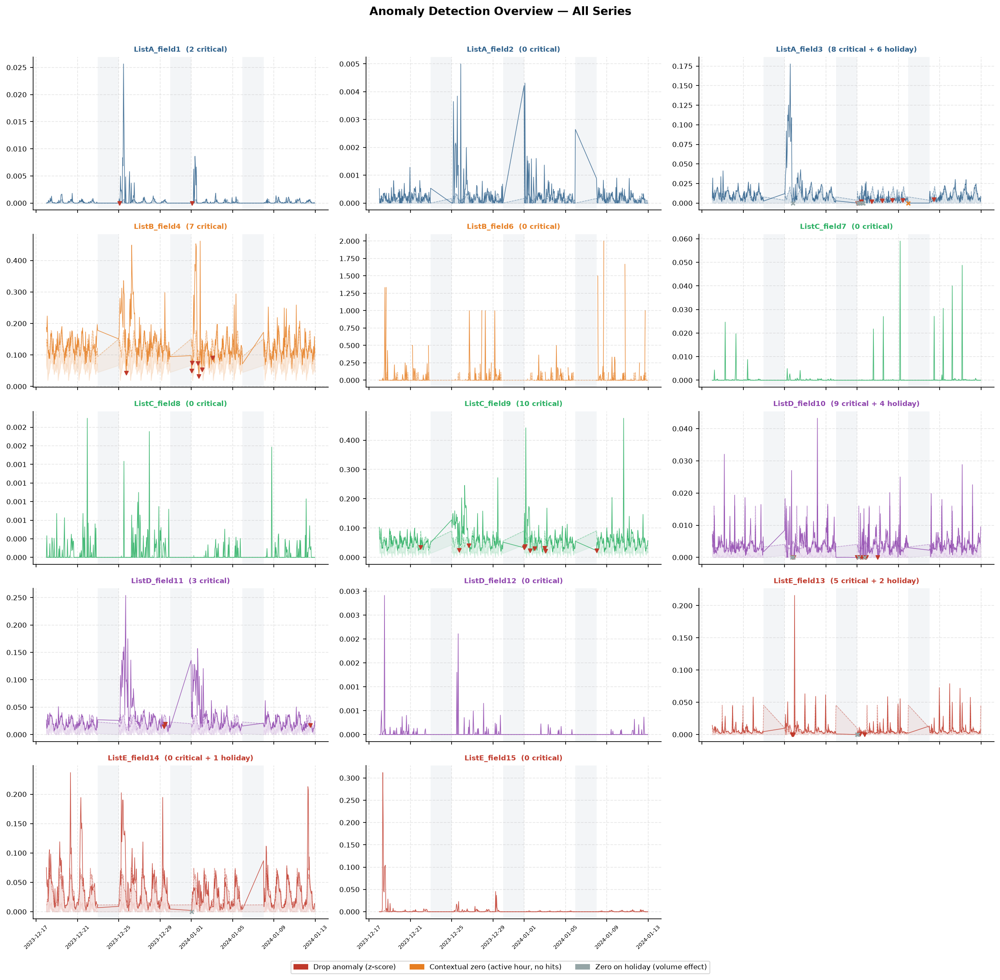

---

### Slide 9 — Threshold defence + reading a result

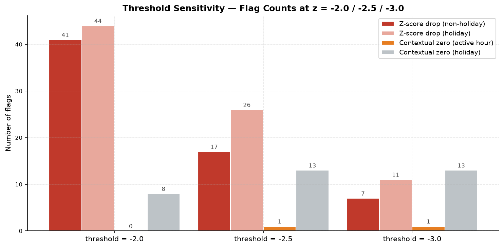

Threshold −2.5 chosen by sensitivity analysis at −2.0 / −2.5 / −3.0:
- −2.0: too noisy (more flags, harder to investigate)
- −3.0: too conservative (misses real events)
- −2.5: balances precision and recall — supported by the validation results

**Example — ListA_field3 (sustained drop from Jan 2):**

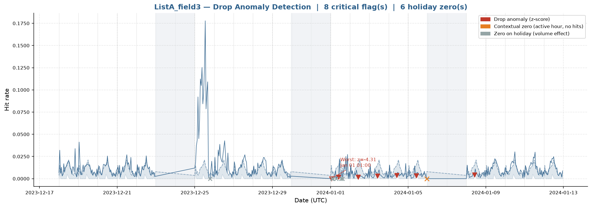

- Top panel: time series with alarm zone (red fill = below threshold), grey expected band, flagged points
- Bottom panel: 24h diurnal profile — marker colour links the flag to its hour-of-day

**Example — ListD_field11 (recurring drops):**

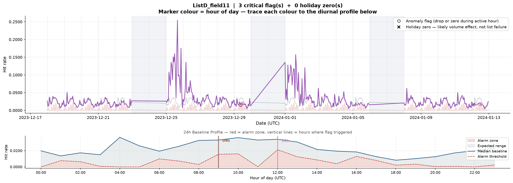

**All flagged series:**

| Series | Plot |
|--------|------|
| ListA_field1 | 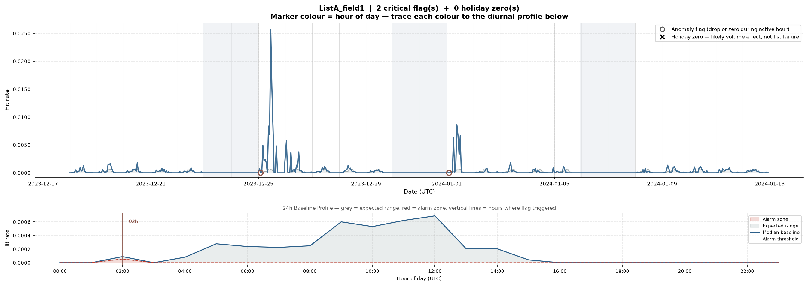 |
| ListB_field4 | 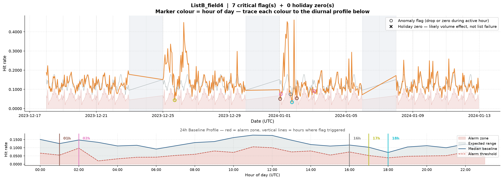 |
| ListC_field9 | 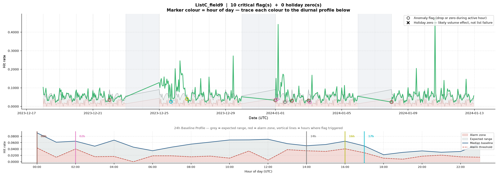 |
| ListD_field10 | 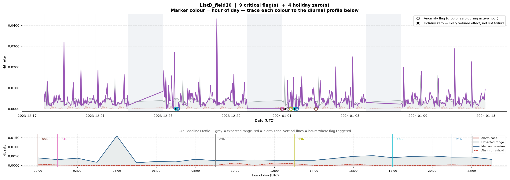 |
| ListE_field13 | 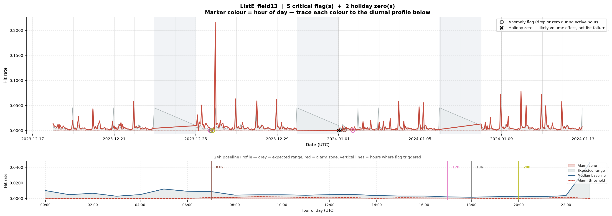 |
| ListE_field14 | 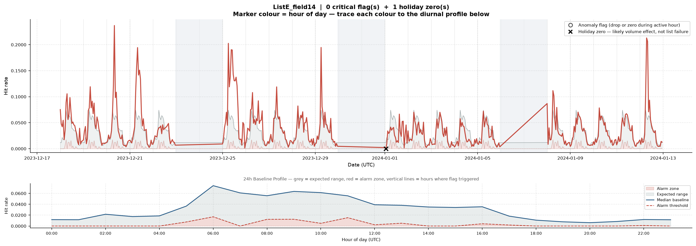 |

---

## Section D — Validation: does the detector work? (slide 10)

*This is the rigour slide. No ground truth exists, so we prove the detector analytically.*

### Slide 10 — Synthetic drop injection

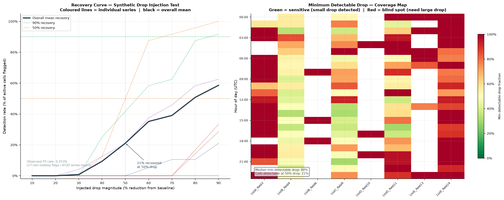

**The question:** We have no labelled anomalies. How do we know the detector catches real drops?

**The method:** inject known drops analytically into the baseline and measure recovery.

For each active (series, hour) cell, simulate:
```
obs_injected = hourly_median × (1 − drop_fraction)
z = −drop_fraction × median / mad
Detected if z < −2.5
```

**Results:**
- At 50% drop: detector catches 21% of events
- At 90% drop: catches 59% of events
- False-positive rate: **0.25%** (17 non-holiday flags / 6,720 scored series-hours)

**The honest interpretation:**
The detector is calibrated for **precision, not recall** — few false alarms, catches large failures.
Overnight cells are red on the coverage heatmap (blind spots): overnight low volume → wide MAD → needs big drop to fire.
This is the hidden denominator problem manifesting directly. **Adding request counts is the single biggest upgrade this system could receive.**

---

## Section E — Method 2: Isolation Forest + SHAP (slides 11–13)

### Slide 11 — Why a second method
PCA failed because series are independent. But independence is *not* a problem for tree-based isolation.

Isolation Forest isolates anomalies by randomly splitting one feature at a time.
Independent features that are sharply separable get isolated near the root of the trees.
Independence is a **strength**, not a weakness.

This makes Isolation Forest the natural multivariate companion to z-score for exactly this data regime.

---

### Slide 12 — What it adds

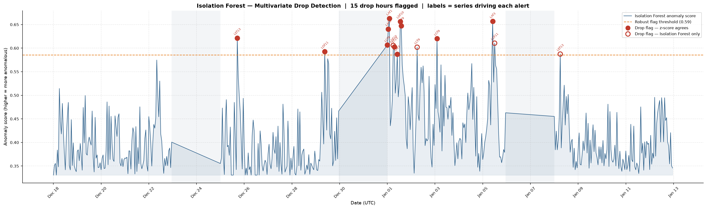

Input: same standardised-residual matrix, clipped to drops only (positive residuals zeroed — we only care about downward extremes).

Output: one multivariate anomaly score per hour.

Agreement with z-score:
- **11 of 44** z-score critical flags independently confirmed by Isolation Forest
- Compare: PCA agreed on only 1 of 44
- Filled ● = both methods agree (highest confidence)
- Hollow ○ = Isolation Forest only (new candidates)

---

### Slide 13 — SHAP reason codes

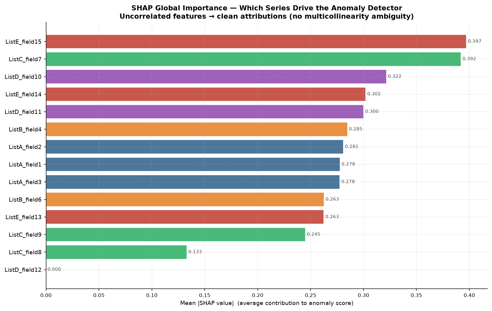

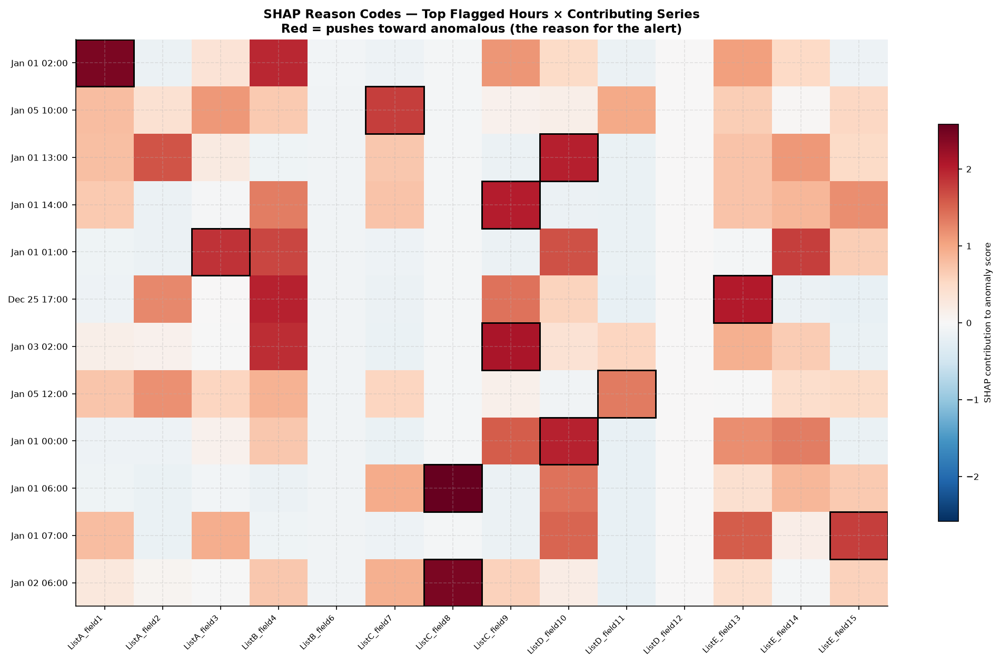

Compliance teams will not act on a black-box score. SHAP attributes each alert to specific series.

Example: "ListA_field3 contributed 0.4 of the anomaly score for Jan 5 10:00."

Because features are uncorrelated, SHAP attributions are clean — no multicollinearity ambiguity. This is the reason code an analyst needs to act.

Global SHAP importance roughly even across series → reinforces independence finding. No single dominant driver.

---

## Section F — Results & Corroboration (slides 14–15)

### Slide 14 — Corroboration grid

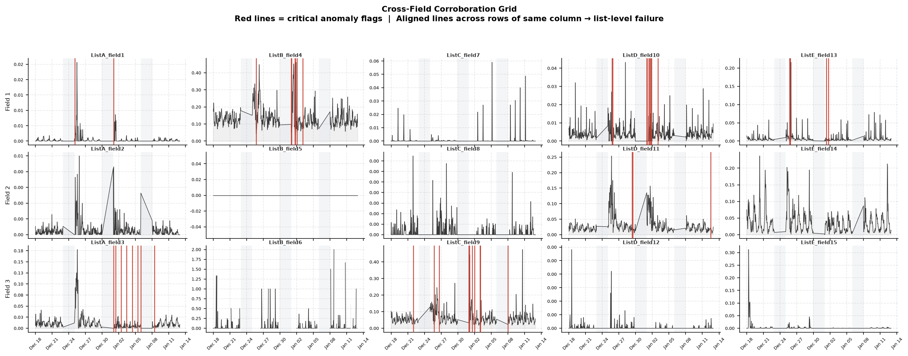

For every flag, check whether sibling fields of the same list also dropped on the same date.

A corrupted sanctions list would hit **all its fields simultaneously** — that signature is absent everywhere.

**Conclusion: no list-level failure in this window.**
Every anomaly is field-scoped — a data pipeline or configuration issue on one field, not list corruption.
Operationally reassuring: the screening lists appear healthy.

---

### Slide 15 — The real drops (ranked by the event view)

**Are these alerts real or sparse-baseline noise?** We audited every top alert against its
baseline observation count. **All 12 top alerts rest on the full 20-observation baseline;
zero low-confidence cells across all active hours.** None is a low-volume artifact.

**ListC_field9 — the top offender** (worst z=−4.30, 5 events, baseline median 0.09):


**ListA_field3 — the clearest *systematic* signature.** Recurring drops at exactly 10:00 on
Jan 2, 3, 4, 5 — same field, same hour, consecutive days. That pattern (not just severity) is
the strongest evidence of a genuine field-pipeline fault:


**ListD_field11** — recurring drops (Dec 29, Jan 12):


Holiday zeros (Dec 25 / Jan 1) are volume effects — correctly separated by the × symbol.

---

## Section G — Operational System, Recommendations & Limitations (slides 16–18)

### Slide 16 — The monitoring dashboard (the deliverable, not just a model)

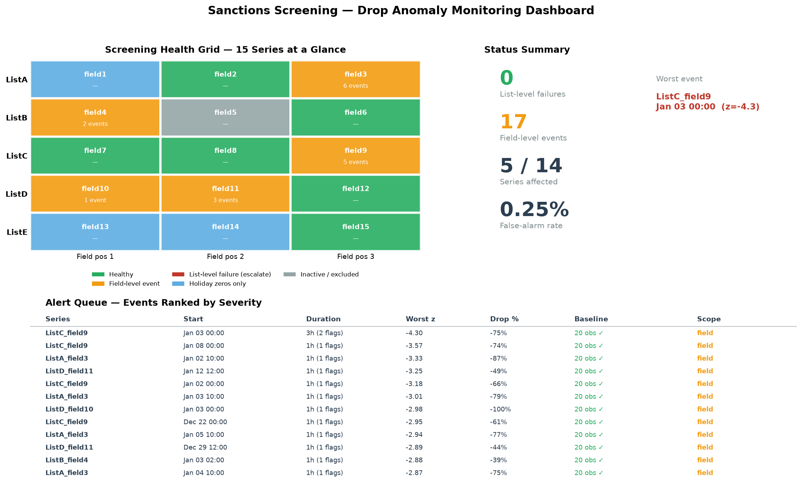

This is what turns "I built a model" into "I built a system ops runs at 9am."
- **Health grid**: 15 series colour-coded (green healthy, amber field-event, red list-failure, blue holiday-only, grey inactive)
- **KPI strip**: list-level failures, field-level events, series affected, false-alarm rate
- **Alert queue**: events ranked by severity, **event-level not hour-level**

**Event-level counting matters:** 57 hour-flags collapse to **42 events (17 non-holiday)**.
A 6-hour sustained drop is ONE event an analyst responds to, not six alerts. Counting hours overstates volume.

### Slide 17 — Recommended alerting rule
**Escalate** when ≥ 2 fields of the same list drop together on the same date → list-level failure (high severity).
**Log for review** when a single field drops → field-level issue (lower severity, investigate data pipeline).

Under this rule: **zero false escalations** in this dataset. The correct outcome.

**Senior addendum — threshold philosophy:** the cost of a missed list corruption (regulatory breach)
vastly exceeds the cost of a false alarm (analyst time). Our −2.5 threshold is precision-tuned
(0.25% FP, 21% recovery at 50% drop). Given the asymmetry, a production system should arguably
run *more* sensitive with a triage layer — trade analyst time for coverage. Naming this trade-off
is the point, not hiding it.

---

### Slide 18 — Limitations & next steps

| Limitation | Impact | Fix |
|---|---|---|
| Hidden denominator (no request volume) | Cannot tighten overnight bands; 80% median min-detectable drop | Add request counts → #1 upgrade |
| No ground truth labels | Cannot compute precision/recall; validation is analytical | Build analyst feedback loop → semi-supervised over time |
| Short history (20 days) | Baseline uncertainty at sparse hours | More data → tighter baselines |
| Weekend exclusion | Weekend behaviour unknown | Include weekends if volume data available |
| ListB_field5 inactive | No detection possible | Confirm series is decommissioned |
| ListB_field6 unstable | Results treated with caution | Investigate data collection issue |

---

## Plot inventory for the deck

| # | File | Slide |
|---|------|-------|
| 01 | time_series_overview | Slide 2 — raw data |
| 03 | data_quality_map | Slide 2 — data quality |
| 02 + 04 | diurnal heatmap + hourly profiles | Slide 4 — diurnal pattern |
| 05 | distributions | Supporting / appendix |
| 06 | correlation heatmap | Slide 5 — independence |
| 09_pca_diagnostic | PCA scree + SPE | Slides 6 + 11 — PCA proof |
| 07 | threshold sensitivity | Slide 9 — threshold defence |
| anomaly_overview | all series overview | Slide 8 — flag taxonomy |
| anomaly_lista_field3 | key drop example | Slide 9 + 15 |
| anomaly_listd_field11 | key drop example | Slide 9 + 15 |
| 13 | validation recovery + heatmap | Slide 10 — validation |
| 10 | Isolation Forest scores | Slide 12 — IF results |
| 11 + 12 | SHAP importance + reasons | Slide 13 — reason codes |
| 08 | corroboration grid | Slide 14 — corroboration |
| 14 | monitoring dashboard | Slide 16 — the operational system |

---

## Key messages to land (one per section)

1. **Drops are the dangerous failure mode** — silent, no alarm, regulatory breach risk
2. **The series are independent** — proved two ways; this shapes every methodological choice
3. **Baseline is hour-specific** — diurnal seasonality is the dominant signal; ignore it and drown in noise
4. **Detector is calibrated for precision** — 0.25% FP rate; catches large failures; honest about blind spots
5. **No list-level failure** — the corroboration grid is the decisive evidence; every anomaly is field-scoped
6. **Hidden denominator is the real constraint** — request volume data is the single most valuable addition

---

## Anticipated interviewer questions — prepared answers

| Question | Answer |
|----------|--------|
| Why hour-of-day, not day-of-week? | Tested: dow cuts residuals only 11.5% but drops baseline from 20 → 4 obs/cell. Not worth it. |
| Only 20 observations per baseline — enough? | Validation quantifies it: catches large drops reliably, weak on subtle ones. Zero low-confidence cells among active hours — every flag rests on a full baseline. |
| Why median/MAD, not mean/std? | Distributions are skewed, zero-heavy, holiday spikes present. Robust stats aren't dragged by outliers. |
| Why threshold −2.5? | Sensitivity analysis (plot 07) + cost asymmetry. Given regulatory stakes I'd argue for *more* sensitive + triage. |
| Is your #1 alert (ListC_field9) real? | Yes — audited: 20-obs baseline, median 0.09, not sparse. Not an artifact. |
| What about a slow, gradual degradation? | The boiling-frog risk. A rolling baseline would adapt and hide it. Fix: freeze a golden baseline from a certified-healthy period. |
| You report 44 flags — really 44 events? | No. 57 hour-flags → 42 events (17 non-holiday). We count events, not hours. |
| Why not a deep-learning / forecasting model? | Considered and rejected. 20 days is thin; detection latency of 1h is fine; forecasting doesn't change the action. Restraint over complexity. |
| How would this run in production? | Hourly batch scoring against a frozen baseline, event-grouping, severity triage, dashboard (plot 14). Baseline itself monitored for drift. |

---

## Phrases to use / avoid

**Use:**
- "We proved independence two ways — correlation and PCA — then designed the method around that proof."
- "The coverage heatmap shows where the detector is watching and where it is blind."
- "Corroboration is the decisive test: list corruption would hit all fields; it didn't."
- "0.25% false-alarm rate means when it fires, it's real."

**Avoid:**
- "The model detected anomalies" (too vague — specify which method, which type)
- "We validated the results" (say *how*: analytical injection, 128 cells, recovery curve)
- "The PCA failed" (reframe: "PCA confirmed the series are independent — that's useful information")
